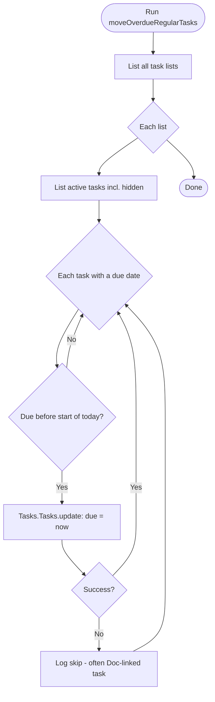
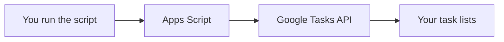

# Google Task Mover

> Small [Google Apps Script](https://developers.google.com/apps-script) project that **rolls overdue Google Tasks to today** (sets each past-due task’s due date to the current date). Only tasks that already have a due date and are **not** completed are updated.

**Limitation:** Tasks created from **Google Docs** usually **cannot** be updated this way; the script skips them when the API returns an error.

---

## How it works



Authorization uses your Google account; no API keys live in the repo.



---

## Installation

| Approach | Where |
|----------|--------|
| **In the browser** | [script.google.com](https://script.google.com) — create or open a standalone project |
| **On your machine** | [clasp](#using-clasp) — edit locally and `push` to the same project |

### In the browser

1. Create or open a **standalone** project.
2. Replace the default `Code.gs` with [`Code.gs`](Code.gs) from this repository.
3. Enable the **Tasks** advanced service: **Services** (+) → **Google Tasks API** (wording may vary). Link a Cloud project if Google asks.
4. Optional: align **Project Settings** (timezone, runtime) with [`appsscript.json`](appsscript.json) — default timezone is `Europe/Berlin`, V8, Stackdriver logging.
5. **Save** the project.

---

## Using clasp

[clasp](https://github.com/google/clasp) syncs your local files to Google (`push` / `pull`) so you can use Git and your editor.

**Prerequisites:** [Node.js](https://nodejs.org/) · [Apps Script API enabled](https://script.google.com/home/usersettings) for your account (toggle **On** under Google Apps Script API).

| Step | Action |
|------|--------|
| 1 | `npm install -g @google/clasp` |
| 2 | `clasp login` (browser sign-in) |
| 3 | Connect the project (see below), then `clasp push` |
| 4 | `clasp open` — authorize and run `moveOverdueRegularTasks` the first time |

The manifest in this repo is [`appsscript.json`](appsscript.json) (standard clasp filename). Adjust `timeZone` or other fields before pushing if needed.

### New Apps Script project

```bash
clasp create --type standalone --title "Google Task Mover"
```

Replace the generated `Code.gs` with this repo’s [`Code.gs`](Code.gs). Merge [`appsscript.json`](appsscript.json) with the generated manifest if you need to keep extra fields from Google, then:

```bash
clasp push
```

### Existing project (already on script.google.com)

**Option A — Clone, then replace files**

```bash
mkdir task-mover && cd task-mover
clasp clone-script "<SCRIPT_ID>"
```

Find **Script ID** under **Project Settings**, or in the URL:  
`https://script.google.com/home/projects/<SCRIPT_ID>/edit`.

Replace the cloned `Code.gs` and `appsscript.json` with this repo’s versions (merge the manifest carefully if you depend on server-only settings). Then `clasp push`.

**Option B — This Git repo is already on disk**

Create `.clasp.json` in the project root:

```json
{ "scriptId": "<SCRIPT_ID>" }
```

Optional: `clasp pull`, then align `Code.gs` and `appsscript.json` with this repository. Then `clasp push`.

After **A** or **B**, run `clasp open` (alias: `clasp open-script`) to open the editor.

**Common commands**

| Command | Purpose |
|---------|---------|
| `clasp pull` | Download remote changes |
| `clasp push --watch` | Push when files change |
| `clasp logs` / `clasp tail-logs` | Execution logs (when configured) |

Details: [clasp README](https://github.com/google/clasp/blob/master/README.md).

**Git:** [`.gitignore`](.gitignore) excludes `.clasprc.json` (OAuth). `.clasp.json` is ignored by default; only commit it if your team intentionally shares the Script ID — never commit OAuth material.

---

## Usage

1. In the Apps Script editor, run **`moveOverdueRegularTasks`** once and complete **authorization**.
2. Check **Executions** or **Logs** (View → Logs, **Ctrl+Enter**) for moved or skipped tasks.

For a **daily overnight** run, add a trigger (next section).

---

## Overnight / scheduled run

The script runs on Google’s servers — no laptop or cron required.

### Set up the trigger (one time)

1. Open **Triggers** (alarm-clock icon in the sidebar).
2. **Add trigger** → function **`moveOverdueRegularTasks`**.
3. Event source: **Time-driven** → **daily** → pick an overnight window (e.g. 2:00–3:00).
4. Save; complete authorization if prompted.

| Topic | Notes |
|-------|--------|
| **Timezone** | Uses the project **Time zone** ([`appsscript.json`](appsscript.json) defaults to `Europe/Berlin`). Align **Project Settings** with where you live. |
| **Effect** | Tasks due **before the start of that calendar day** get moved to **today**. A 3:00 AM run still uses that same calendar day as “today.” |
| **Logs** | Use **Executions** or **View → Logs** after runs. |

### clasp and scheduling

clasp **does not** create time-driven triggers, and the [Execution API](https://developers.google.com/apps-script/api/how-tos/execute#limitations) used by `clasp run` cannot run `ScriptApp.newTrigger`. Sync code with `clasp push`, then use **`clasp open`** and the **Triggers** UI once. Later `clasp push` calls keep the same trigger unless you rename the function or delete it.

---

## Security and privacy

There are no secrets in source; the script runs as your Google identity. Logs may include **list and task titles** — factor that in before sharing the project.

---

## Files

| File | Purpose |
|------|---------|
| [`Code.gs`](Code.gs) | `moveOverdueRegularTasks` |
| [`appsscript.json`](appsscript.json) | Timezone, Tasks advanced service, V8, Stackdriver logging |
